<div align="center">
  
</div>

<div align="center">
  <a href="https://git.io/typing-svg">
    
  </a>
</div>

<p align="center">
  <a href="https://mohenghui.github.io"></a>
  <a href="https://github.com/mohenghui?tab=repositories"></a>
  
</p>

> **`VISION / VECTOR / VELOCITY`**  
> 我是 **Henghui Mo**，专注计算机视觉与深度学习。从目标检测、数据自动标注，到汉字笔画轨迹与字体图像处理——我喜欢把研究想法做成真正能跑的工具。

## `01. NOW / 正在做`

```text
┌─ CURRENT FOCUS
│
├─ ◉ Object Detection     YOLO · attention mechanisms · deployment
├─ ◉ Vision Tooling       annotation · preprocessing · automation
├─ ◉ Chinese Typography   stroke recovery · OCR · vectorization
└─ ◉ Applied AI           turning papers into practical systems
```

## `02. FEATURED BUILDS / 代表项目`

<div align="center">
  <a href="https://github.com/mohenghui/detectAuto">
    
  </a>
  <a href="https://github.com/mohenghui/yolov5_attention">
    
  </a>
  <a href="https://github.com/mohenghui/shufa">
    
  </a>
  <a href="https://github.com/mohenghui/yolov5_flask">
    
  </a>
</div>

| Project | What it does |
| :--- | :--- |
| [`detectAuto`](https://github.com/mohenghui/detectAuto) | 用 YOLOv5 自动生成目标检测标注，减少重复的数据准备工作 |
| [`yolov5_attention`](https://github.com/mohenghui/yolov5_attention) | 集成 ECA / CA / SE / CBAM 等注意力机制的 YOLOv5 实验场 |
| [`shufa`](https://github.com/mohenghui/shufa) | 从手写汉字图像中提取并复原笔顺轨迹，支持 GIF 可视化 |
| [`yolov5_flask`](https://github.com/mohenghui/yolov5_flask) | 支持图片、视频和摄像头输入的 YOLOv5 Web 部署方案 |

## `03. TOOLBOX / 技术栈`

<div align="center">
  
</div>

## `04. SIGNAL / 开发信号`

<div align="center">
  
  
</div>

<div align="center">
  
</div>

## `05. CONTRIBUTION STREAM`

<div align="center">
  <picture>
    <source media="(prefers-color-scheme: dark)" srcset="https://raw.githubusercontent.com/mohenghui/mohenghui/output/github-contribution-grid-snake-dark.svg" />
    <source media="(prefers-color-scheme: light)" srcset="https://raw.githubusercontent.com/mohenghui/mohenghui/output/github-contribution-grid-snake.svg" />
    
  </picture>
</div>

<br />

<div align="center">
  <sub><code>BUILD → OBSERVE → ITERATE → SHIP</code></sub>
  <br /><br />
  
</div>
